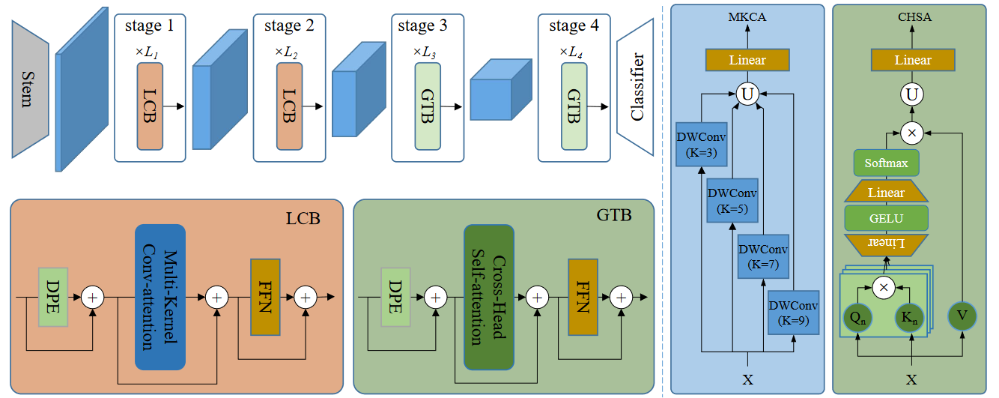
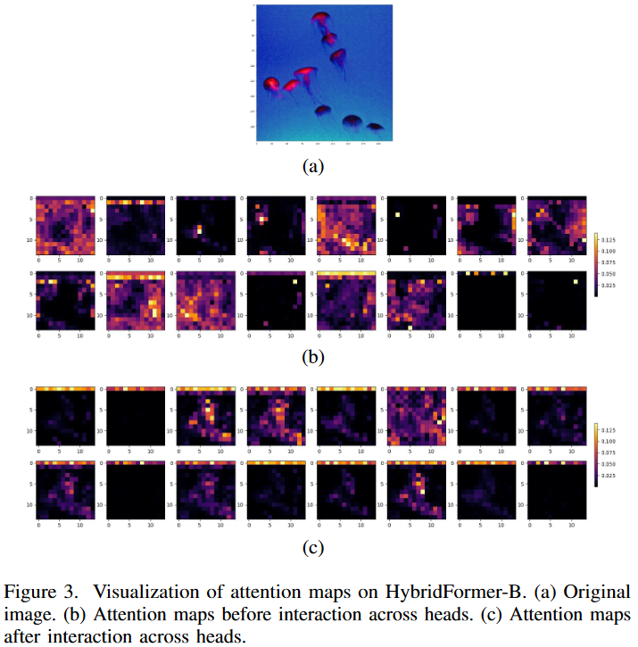
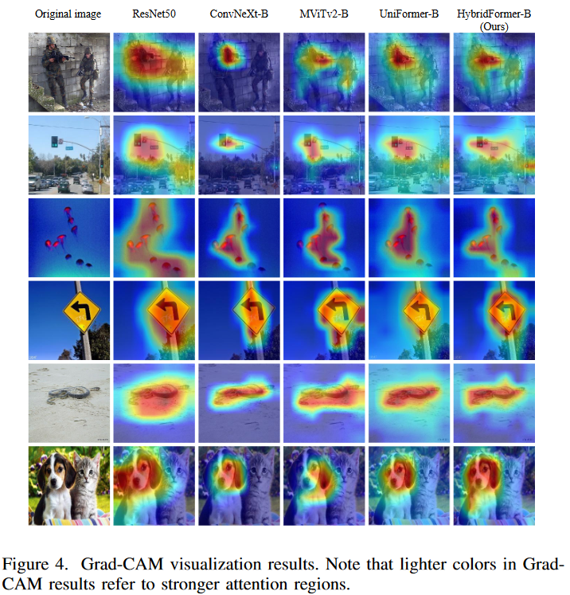
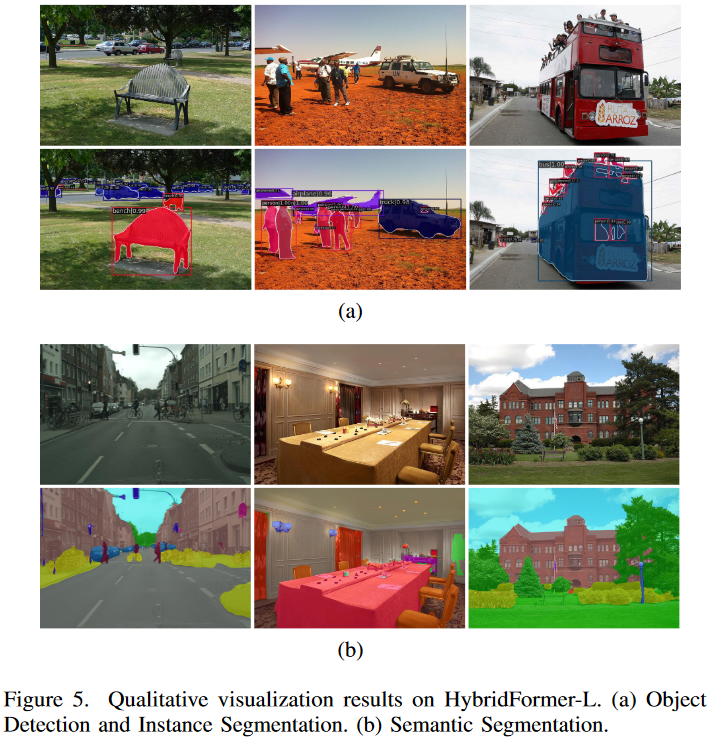

## Introduction

**HybridFormer** is composed of two main building blocks, i.e., local convolution block (LCB) and global transformer block (GTB).  The proposed HybridFormer integrates the merits of improved convolution and self-attention to balance redundancy and dependency for effective and efficient representation learning. We estimate HybridFormer through extensive experiments, demonstrating that it achieves state-of-the-art (SOTA) performance on numerous vision tasks, including image classification, object detection, and semantic segmentation.

without any extra training data and labels, our HybridFormer achieves a top-1 accuracy of **84.6%** on the ImageNet-1K image classification task with ∼11G FLOPs.without any extra training data and labels, our HybridFormer achieves a top-1 accuracy of **84.6%** on the ImageNet-1K image classification task with ∼11G FLOPs. With only ImageNet-1K pre-training, on downstream tasks, it obtains **48.9** box AP and **44.1** mask AP on COCO object detection task, **+1.5** box AP and **+1.0** mask AP higher than UniFormer with **∼16%** fewer parameters, and 48.9 mIoU on ADE20K semantic segmentation task, about **+1** higher mIoU than UniFormer with **∼25%** fewer FLOPs.

    <h3> General Framework </h3>

    

## Main results on Image Classification

We perform image classification experiments on the ImageNet-1K dataset. We compare our HybridFormer with recent stateof-the-art methods, as shown in the Table, where models are grouped by the amount of computations.

| Model           | #Params(M)  | FLOPs(G)   | Top-1(%) | Reference |
| --------------- | ----------- | ---------- | -------- | --------- |
| LIT-S           | 27          | 4.1        | 81.5     |AAAI22     |
| CrossFormer-S   | 30.7        | 4.9        | 82.5     |ICLR22     |
| iFormer-S       | 20          | 4.8        | 83.4     |NeurIPS22  |
| CETNet-T        | 23          | 4.3        | 82.7     | ECCV22    |
| DaViT-Tiny      | 28.3        | 4.5        | 82.8     | ECCV22    |
| ScalableViT-S   | 32          | 4.2        | 83.1     | ECCV22    |
| MixFormer-B4    | 35          | 3.6        | 83.0     | CVPR22    |
| DAT-T           | 29          | 4.6        | 82.0     | CVPR22    |
| MViTv2-T        | 24          | 4.7        | 82.3     | CVPR22    |
| NAT-T           | 28          | 4.3        | 83.2     | CVPR23    |
| UniFormer-S     | 22          | 3.6        | 82.9     | TPAMI23   |
|**HybridFormer-S**|**21.6**    | **4.3**    | **83.4** |           |
|RegionViT-M      | 41.2        | 7.4        | 83.1     | ICLR22    |
|CETNet-S         | 34          | 6.8        | 83.4     | ECCV22    |
|MOAT-0           | 27.8        | 5.7        | 83.3     | ICLR23    |
|MViTv2-S         | 35          | 7.0        | 83.6     | CVPR22    |
|NAT-S            | 51          | 7.8        | 83.7     | CVPR23    |
|PaCa-Small       | 22.0        | 5.5        | 83.1     | CVPR23    |
|InternImage-T    | 30          | 5.0        | 83.5     | CVPR23    |
|**HybridFormer-B**| **29.9**   | **6.2**    | **83.8** |           |
|LIT-M            | 48          | 8.6        | 83.0     | AAAI22    |
|CrossFormer-B    | 52.0        | 9.2        | 83.4     | ICLR22    |
|DaViT-Small      | 49.7        | 8.8        | 84.2     | ECCV22    |
|ScalableViT-B    | 81          | 8.6        | 84.1     | ECCV22    |
|DAT-S            | 50          | 9.0        | 83.7     | CVPR22    |
|MOAT-1           | 41.6        | 9.1        | 84.2     | ICLR23    |
|PaCa-Base        | 46.9        | 9.5        | 84.0     | CVPR23    |
|InternImage-S    | 50          | 8.0        | 84.2     | CVPR23    |
|UniFormer-B      | 50          | 8.3        | 83.9     | TPAMI23   |
|**HybridFormer-L**| **38.3**   |**8.0**     |**84.2**  |           |
|LIT-B            | 86          | 15.0       | 83.4     | AAAI22    |
|RegionViT-B      | 72.7        | 13.0       | 83.2     | ICLR22    |
|CrossFormer-L    | 92.0        | 16.1       | 84.0     | ICLR22    |
|CETNet-B         | 75          | 15.1       | 83.8     | ECCV22    |
|DaViT-Base       | 87.9        | 15.5       | 84.6     | ECCV22    |
|ScalableViT-L    | 104         | 14.7       | 84.4     | ECCV22    |
|MViTv2-B         | 52          | 10.2       | 84.4     | CVPR22    |
|DAT-B            | 88          | 15.8       | 84.0     | CVPR22    |
|NAT-B            | 90          | 13.7       | 84.3     | CVPR23    |
|**HybridFormer-H**| **55.2**   | **11.6**   | **84.6** |           |

## Main results on Object Detection and Instance Segmentation

We evaluate the proposed models on object detection and instance segmentation with the COCO2017 dataset. We report the comparison results on the object detection task and instance segmentation task in the Table.

    <table>
        <tr >
            <td rowspan="2">Method</td>
            <td rowspan="2">#Params</td>
            <td rowspan="2">FLOPs</td>
            <td colspan="6" style="text-align: center">Mask R-CNN 1 × schedule</td>
        </tr>
        <tr >
            <td>APb</td>
            <td>APb50</td>
            <td>APb75</td>
            <td>APm</td>
            <td>APm50</td>
            <td>APm75</td>
        </tr>
        <tr>
            <td>DAT-T</td><td>48</td><td>272</td><td>44.4</td><td>67.6</td><td>48.5</td><td>40.4</td>				<td>64.2</td><td>43.1</td>
        </tr>
            <td>PVT-M</td><td>64</td><td>302</td><td>42.0</td><td>64.4</td><td>45.6</td><td>39.0</td>				<td>61.6</td><td> 42.1</td>
        <tr>
            <td>CETNet-T</td><td>43</td><td>261</td><td>45.5</td><td>67.7</td><td>50.0</td><td>40.7</td>
            <td>64.4</td><td>43.7</td>
        </tr>
            <td>ScalableViT-S</td><td>46</td><td>256</td><td>45.8</td><td>67.6</td><td>50.0</td>					<td>41.7</td><td>64.7</td><td>44.8</td>
        <tr>
            <td>CrossFormer-S</td><td>50</td><td>301</td><td>45.4</td><td>68.0</td><td>49.7</td>					<td>41.4</td><td>64.8</td><td>44.6</td>
        </tr>
        <tr>
            <td>MixFormer-B3</td><td>35</td><td>207</td><td>42.8</td><td>64.5</td><td>46.7</td>						<td>39.3</td><td>61.8</td><td>42.2</td>
        </tr>
        <tr>
            <td>DAT-T</td><td>48</td><td>272</td><td>44.4</td><td>67.6</td><td>48.5</td><td>40.4</td>				<td>64.2</td><td>43.1</td>
        </tr>
        <tr>
            <td>PaCa-Small</td><td>42</td><td>296</td><td>46.4</td><td>68.7</td><td><strong>50.9</strong>			</td><td>41.8</td><td><strong>65.5</strong></td><td>45.0</td>
        </tr>
        <tr>
            <td>UniFormer-Sh14</td><td>41</td><td>269</td><td>45.6</td><td>68.1</td><td>49.7</td>					<td>41.6</td><td>64.8</td><td>45.0</td>
        </tr>
       <tr>
            <td><strong>HybridFormer-S (ours)</strong></td><td>41</td><td>309</td><td><strong>46.5</strong>				</td><td><strong>68.8</strong></td><td>50.8</td><td><strong>42.4</strong></td><td><strong>65.5</strong></td><td><strong>45.7</strong></td>
        </tr>
        <tr>
            <td>DAT-S</td><td>69</td><td>378</td><td>47.1</td><td>69.9</td><td>51.5</td><td>42.5</td>				<td>66.7</td><td>45.4</td>
        </tr>
        <tr>
            <td>PVT-L</td><td>81</td><td>364</td><td>42.9</td><td>65.0</td><td>46.6</td><td>39.5</td>				<td>61.9</td><td>42.5</td>
        </tr>
        <tr>
            <td>CETNet-S</td><td>53</td><td>315</td><td>46.6</td><td>68.7</td><td>51.4</td><td>41.6</td>			<td>65.4</td><td>44.8</td>
        </tr>
        <tr>
            <td>ScalableViT-B</td><td>95</td><td>349</td><td>46.8</td><td>68.7</td><td>51.5</td>					<td>42.5</td><td>65.8</td><td>45.9</td>
        </tr>
        <tr>
            <td>CrossFormer-B</td><td>72</td><td>408</td><td>47.2</td><td>69.9</td><td>51.8</td>					<td>42.7</td><td>66.6</td><td>46.2</td>
        </tr>
        <tr>
            <td>MixFormer-B4</td><td>53</td><td>243</td><td>45.1</td><td>67.1</td><td>49.2</td>						<td>41.2</td><td>64.3</td><td>44.1</td>
        </tr>
        <tr>
            <td>DAT-S</td><td>69</td><td>378</td><td>47.1</td><td>69.9</td><td>51.5</td><td>42.5</td>				<td>66.7</td><td>45.4</td>
        </tr>
        <tr>
            <td>PaCa-Base</td><td>67</td><td>373</td><td>48.0</td><td>69.7</td><td>52.1</td><td>42.9</td>			<td>66.6</td><td>45.6</td>
        </tr>
        <tr>
            <td>UniFormer-Bh14</td><td>69</td><td>399</td><td>47.4</td><td>69.7</td><td>52.1</td>					<td>43.1</td><td>66.0</td><td>46.5</td>
        </tr>
        <tr>
            <td><strong>HybridFormer-L (ours)</strong></td><td>58</td><td>433</td><td><strong>48.9</strong>				</td><td><strong>71.0</strong></td><td><strong>53.7</strong></td><td><strong>44.1</strong>				</td><td><strong>68.0</strong></td><td><strong>47.8</strong></td>
        </tr>
    </table>

## Main results on Semantic Segmentation
We also evaluate our models on semantic segmentation with the ADE20K dataset. The table reports the results of different frameworks.

    <table>
    	<tr >
            <td rowspan="2">Method</td>
            <td colspan="3" style="text-align: center">Semantic FPN</td>
        </tr>
        <tr>
            <td>#Params(M)</td>
            <td>FLOPs(G)</td>
            <td>mIoU(%)</td>
        </tr>
        <tr>
        	<td>DAT-T</td><td>32</td><td>198</td><td>42.6</td>
        </tr>
        <tr>
        	<td>PVT-M</td><td>48</td><td>219</td><td>41.6</td>
        </tr>
        <tr>
        	<td>ScalableViT-S</td><td>30</td><td>174</td><td>44.9</td>
        </tr>
        <tr>
        	<td>CrossFormer-S</td><td>34</td><td>221</td><td>46.0</td>
        </tr>
        <tr>
        	<td>DAT-S</td><td>53</td><td>320</td><td>46.1</td>
        </tr>
        <tr>
        	<td>UniFormer-S</td><td>25</td><td>247</td><td>46.6</td>
        </tr>
        <tr>
        	<td><strong>HybridFormer-S (ours)</strong></td><td>25</td><td>229</td><td><strong>47.6</strong>				</td>
        </tr>
        <tr>
        	<td>DAT-S</td><td>53</td><td>320</td><td>46.1</td>
        </tr>
        <tr>
        	<td>PVT-L</td><td>65</td><td>283</td><td>42.1</td>
        </tr>
        <tr>
        	<td>ScalableViT-B</td><td>79</td><td>270</td><td>48.4</td>
        </tr>
        <tr>
        	<td>CrossFormer-B</td><td>56</td><td>331</td><td>47.7</td>
        </tr>
        <tr>
        	<td>DAT-B</td><td>92</td><td>481</td><td>47.0</td>
        </tr>
        <tr>
        	<td>UniFormer-B</td><td>54</td><td>471</td><td>48.0</td>
        </tr>
        <tr>
        	<td><strong>HybridFormer-L (ours)</strong></td><td>42</td><td>358</td><td><strong>48.9</strong></td>
        </tr>
    </table>

## VISUALIZATION

### Visualization of Attention Map

To understand how CHSA works, we visualize attention maps at the last block of the 3rd stage and compare them before and after the across-head interaction, as shown in Fig. 3.

    

### Class Activation Mapping

To further demonstrate the effectiveness of our approach, we apply Grad-CAM to visualize discriminative regions generated by ResNet50, ConvNeXt-B, MViTv2-B, UniFormer-B, and our HybridFormer-B, as shown in Fig. 4.

    

### Qualitative Visualization

In Fig. 5, we also conduct qualitative visualization on validation datasets for downstream tasks, including object detection and semantic segmentation.

    

## Authorship

This project is contributed by [Qingbei Guo](https://github.com/QingbeiGuo).

Note: Code coming soon

## Citation

